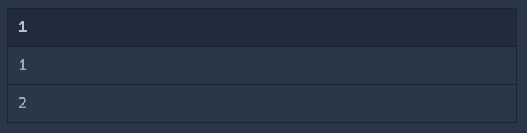

# 프로그래머스 SQL
### SELECT
- 모든 레코드 조회하기
    - SELECT * 써보기
- 역순 정렬하기
    - ORDER BY 써보기
- 아픈 동물 찾기
    - WHERE 써보기
- 어린 동물 찾기
    - WHERE 써보기
- 동물의 아이디와 이름
    - 여러 column을 가져오기
- 여러 기준으로 정렬하기
    - ORDER BY 기준 여러개 순차적으로 주기
- 상위 n개 레코드
    - LIMIT 써보기

### SUM, MAX, MIN
- 최댓값 구하기
    - MAX 사용해보기
- 최솟값 구하기
    - MIN 사용해보기
- 동물 수 구하기
    - SUM 사용해보기
- 중복 제거하기
    - DISTINCT 써보기

### GROUP BY
- 고양이와 개는 몇마리 있을까
    - GROUP BY 써보기
- 동명 동물 수 찾기
    - GROUP BY + 조건
- 입양 시각 구하기(1)
    - GROUP BY + 조건
- 입양 시각 구하기(2)
    - WITH로 임시 테이블 다뤄보기 / sql 변수 사용해보기

### IS NULL
- 이름이 없는 동물의 아이디
    - IS NULL 사용해보기
- 이름이 있는 동물의 아이디
    - IS NOT NULL 사용해보기

### JOIN
- 없어진 기록 찾기
    - JOIN써보기
- 있었는데요 없었습니다
    - JOIN + ORDER BY
- 오랜 기간 보호한 동물(1)
    - JOIN + ORDER BY + LIMIT
- 보호소에서 중성화한 동물
    - JOIN + LIKE


### SQL Knowledge
- 테이블 고르기 : SELECT
    ```
    SELECT * FROM table_name;
    ```
- 정렬하기 : ORDER BY
    ```
    ORDER BY column_name;
    ```
- 순서 : ASC(작->큰), DESC(큰->작)
    ```
    ORDER BY column_name DESC;
    ```
- 그룹 짓기 : GROUP BY
    ```
    GROUP BY column_name;
    ```
- 개수 세기 : COUNT()
    ```
    SELECT COUNT(column_name) FROM table_name;
    ```
- DATETIME 다루기 : YEAR(), MONTH(), HOUR()
    ```
    SELECT HOUR(column_name) FROM table_name;
    ```
- LIMIT 1 -> 맨뒤에 써서 출력할 개수 구하기
    ```
    SELECT * FROM table_name LIMIT 3;
    ```
- 중복 제거 : DISTINCT
    ```
    SELECT COUNT(DISTINCT column_name) FROM table_name;
    ```
- WHERE : 그룹짓기 이전에 사용하는 조건식
    ```
    WHERE column_name > 3 AND column_name < 100;
    ```
- HAVING : 그룹지은 이후에 사용하는 조건식
    ```
    HAVING column_name > 3 AND column_name < 100;
    ```
- 최대/최소 : MIN(), MAX()
    ```
    MIN(column_name)
    MAX(column_name)
    ```
- 변수 선언 : SET @변수명 := 값
    ```
    SET @variable := 0
    ```
- UNION : 두개의 조회 결과 colunmn안에 합치기(중복 자동 제거)
    ```
    SELECT 1
    UNION 
    SELECT 2
    ```
- UNION ALL : 두개의 조회 결과 중복 고려하지 않고 전부 합친다.
- 가상 테이블 생성: WITH
    ```
    WITH new_table AS (
        SELECT 1
        UNION
        SELECT 2
    )
    ```
    - WITH 응용1 column_name 지정
        ```
        WITH new_table(column_name) AS (
            SELECT 1
            UNION
            SELECT 2
        )
        ```
    - WITH 응용2 column_name을 변수처럼 사용하기 (정확히는 table의 column을 가져다 쓰는것)
        - 예시 : 입양 시각 구하기(2)
    
- AS로 고른 값 컬럼명 변경하기
    ```
    SELECT column AS c FROM table;
    ```
- SELECT로 숫자 넣기
    ```
    SELECT 1,2,3;
    ```
    결과
    
- SELECT + UNION
    ```
    SELECT 1 UNION SELECT 2;
    ```
    결과
     
- 아래와 같이 SELECT하는 대상에 다른 테이블의 값을 합치고 싶으면 한줄씩 가져와야한다.
    ```
    SELECT col1,(
        SELECT col2 FROM table2
        WHERE 조건
        ) FROM table1
    ```
    - 입양 시각 구하기(2) 참고
- IF문
    ```
    SELECT IF(IS NULL(column), '원하는 값', column) as NAME FROM table_name
    ```
- JOIN
    - LEFT JOIN은 왼쪽을 기준으로 오른쪽과의 교집합
    - RIGHT JOIN은 오른쪽을 기준으로 왼쪽과의 교집합
    - OUTER JOIN은 여집합
    - INNER JOIN은 교집합
    - 유의해야할점
        - 출력하고자 하는 값이 포함된 컬럼을 SELECT 해야함!
        - ON으로 table 합칠 기준 설정 필요함
    ```
    SELECT table1.id, table1.col FROM table1
    LEFT JOIN table2 -- table1을 기준으로 table2와의 교집합을 찾음
    ON table1.id = table2.id -- 합칠 기준
    ```
- LIKE : 원하는 문자열 포함 여부 확인하기
    - 원하는 문자열 포함 여부
        ```
        WHERE column LIKE '%원하는 문자열%'
        ```
    - 원하는 문자열로 시작하는지
        ```
        WHERE column LIKE '%원하는 문자열'
        ```
    - 원하는 문자열로 끝나는지
        ```
        WHERE column LIKE '원하는 문자열%'
        ```


